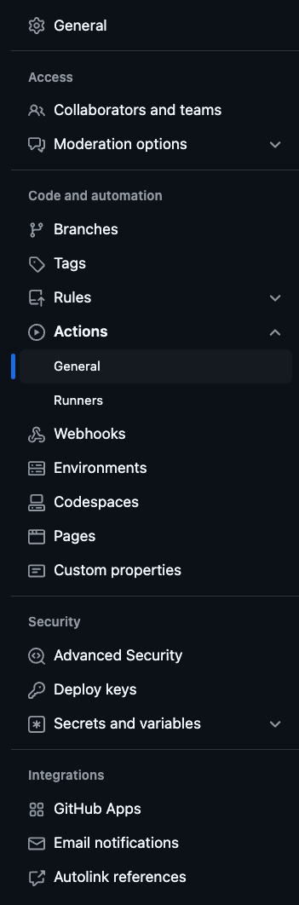
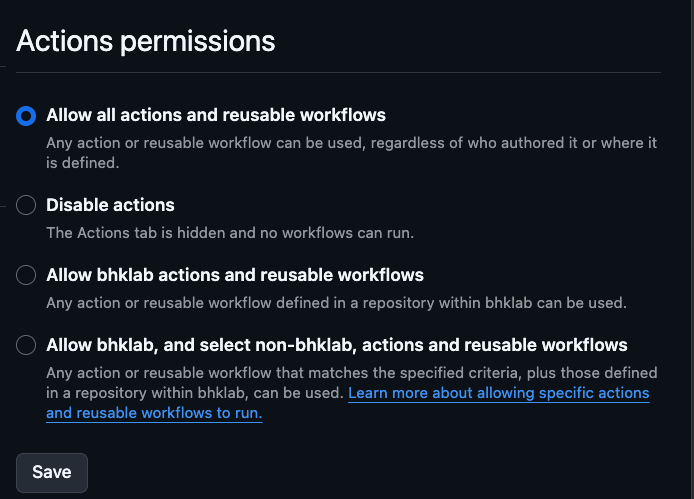
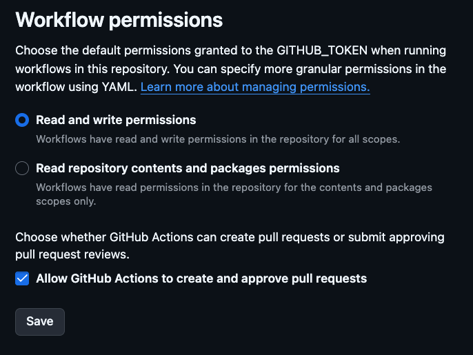
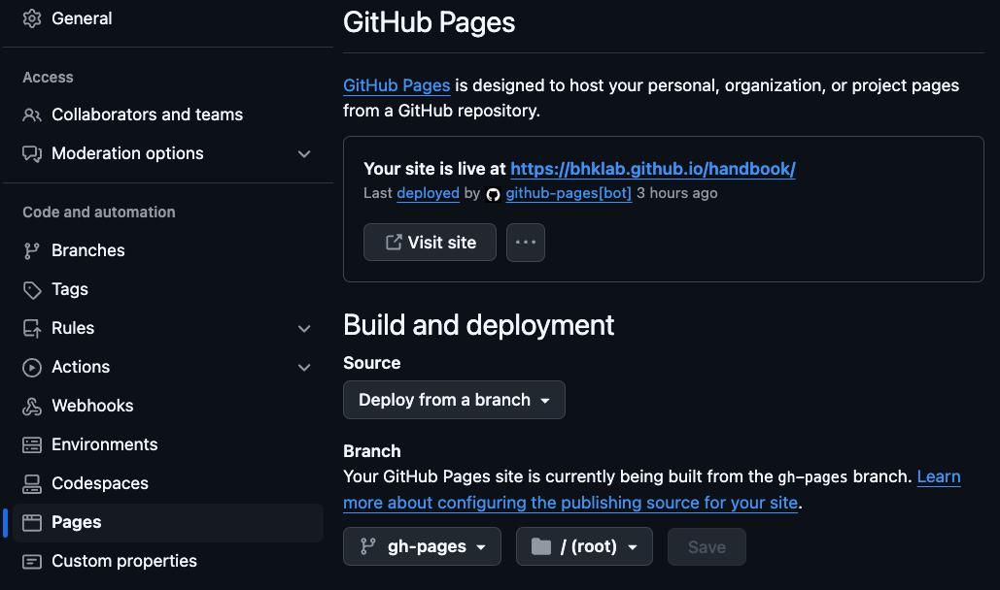

# Project Template for BHKLab Projects

## How this works

This project uses the [copier tool](https://copier.readthedocs.io) to maintain
a standardized project template that follows the general structure of BHKLab
repositories.

Copier facilitates the management of project templates by
using [jinja2](https://jinja.palletsprojects.com/) templating for file/directory
names and content in the template.

## Requirements

**1: Make sure you have the `pixi` tool installed.**

Visit the [pixi documentation](https://pixi.sh)

**2: Make sure you have the `gh` github cli tool installed and logged in**

> [!NOTE]
> I recommend using `pixi exec gh` which can use the tool without installing it
> but you can just install it globally and not prefix it with `pixi exec`.

```console
pixi exec gh auth login --hostname 'github.com' --git-protocol ssh
```

Follow the instructions to authenticate with your GitHub account.

> [!WARNING]
> Make sure you have been added to our lab organization(s) before proceeding!

## Usage

**Run the following command to create a new project.**
**Replace `${PROJECT_NAME}` with the name of your project.**

```console
pixi exec --spec copier -- copier copy --trust --vcs-ref HEAD https://github.com/bhklab/bhklab-project-template <PROJECT_NAME>
```

## FYI: I have tried to enable ALL of the BELOW features automatically, but leaving them here for now in case there are issues with the automatic setup

## Setting up GitHub Actions

**Step 1: Go to `settings` > `Actions` > `General` in your GitHub repository.**


**Step 2: Select `Allow all actions and reusable workflows` in the `Workflow permissions` section + CLICK `Save`**


**Step 3: Scroll down to the `Workflow permissions` section and select `Read and write permissions AND Allow GitHub Actions to create and approve pull requests`**


## Setting up GitHub Pages

>[!NOTE]
> Before being able to deploy the documentation, you need to set up GitHub Pages.
> This is a one-time setup for the repository. The documentation will be deployed
> automatically to GitHub Pages when you push to the `main` branch.
> However, you need to create a `gh-pages` branch in your repository.
> You can do this by running the following command:
    ```console
    git branch gh-pages
    git push origin gh-pages
    ```
> This is only possible after you have created the repository on GitHub.

The template will use mkdocs to build the documentation and deploy it to GitHub Pages.
To set up GitHub Pages, follow these steps:
**Step 1: Go to `settings` > `Pages` in your GitHub repository.**

**Step 2: Select `Deploy from a branch` in the `Source` section.**

**Step 3: Select `gh-pages` branch and `/ (root)` folder in the `Branch` section.**

**Step 4: Click `Save`.**


## Issues

Please report any issues with the template to the
[bhklab/bhklab-project-template](https://github.com/bhklab/bhklab-project-template).
